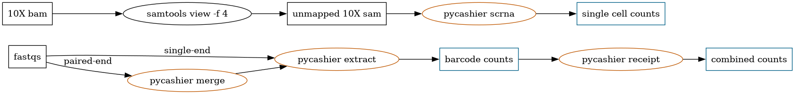

# Summary

`Pycashier` is a tool designed to extract cellular DNA barcode tags from next generation sequencing data.
These DNA barcode tags are heritable and stably integrated genetic markers useful for clonal tracking (CITE) (clontracr?)
and lineage tracing (development) (gestalt) within *in vitro* and *in vivo* cell-based disease models.
These exogenous cell-based DNA barcodes, when amplified from genomic DNA and sequenced,
can be used as a proxy for assessing changes in clonal abundance and better understanding population dynamics.
`Pycashier` was originally developed for use with the
ClonMapper Barcoding System [@alkhafaji2018;@gardner2024;@gardner2022]),
which is comprised of random 20 nucleotide barcodes integrated as both a functional gRNA and expressed transcript.
`Pycashier` has been previously utilized to interrogate
tumor heterogeneity in barcoded cancer cell-line models [@gutierrez2021;@johnson2020],
however, it is generalizable to similar DNA barcoding systems with known flanking regions and expected length.

# Statement of need

DNA sequencing and cellular DNA barcoding specifically, have become
more common as a modality for the characterization of clonal and lineage-specific subpopulations of cells.
As researchers leverage these technologies, they'll require tools easy to setup
and use to facilitate downstream biological analysis.
DNA barcode sequencing suffers from several sources of noise that must be accounted for prior to statistical analysis.
This noise can arise in typical Polymerase Chain Reaction (PCR) preparation [@kebschull2015;@potapov2017] or during read-out [@manley2016].
Historically, the analysis of cellular DNA barcoding has relied on tailored computational workflows,
such as TimeMachine [@emert2021], that are difficult to parameterize
or extend to similarly designed cellular DNA barcoding systems.
Recently, there has been the development of several NextFlow-based techniques,
such as BARtab [@holze2024] and NextClone [@putri2023],
In particular BARtab and it's associated post-processing library bartools, offer an end-to-end toolkit for barcoding analysis.
As a more feature complete end-to-end toolkit BARtab differs from `pycashier` by including support for spatial transcriptomics data and reference-based processing of barcodes.Additionally, being based on NextFlow offers some advantages to these tools including sample-level parameterization and tighter control on system resources.
However, experience using NextFlow may be uncommon for experimentalists.
`Pycashier` aims to be simple to install and generalizable enough to be useful to the broader community while also providing a user friendly interface.

# Implementation and Usage

`Pycashier` was intentionally designed to be simple-to-use for both computational and experimental biologists.
It accomplishes this by leveraging purpose-built software for an opinionated DNA barcode processing pipeline.
`Pycashier` has a command-line interface (CLI) implemented in `python`.
Users have the option of installing `pycashier` with `pip`, `conda`/`mamba`/`pixi` (from conda-forge),
or as a standalone `Docker` image which includes all necessary runtime dependencies for maximum reproducibility.
`Pycashier` maintains outputs and logs of all steps for simple debugging and reuse across a project.
The `pycashier` CLI has four subcommands to facilitate processing of DNA barcode sequencing data,
`extract`, `merge`, `scrna` and `receipt` (Figure 1).
Users can specify parameters either through command-line flags or through a configuration `toml` file.

`Pycashier` is primarily used for generating counts of individual barcode sequences
from targeted PCR amplifications of DNA-barcoded cells.
`Pycashier` extracts these DNA barcode sequences without the use of any pre-defined list.
This makes it amenable to systems in which sequences are not known ahead of time
or randomly generated as in the case of ClonMapper.
This is done with `pycashier extract`, which accepts a directory of
`fastq` files directly from Illumina sequencing and generates
a `tsv` of individual barcodes and counts for each input `fastq`.
These sequences should be an expected length (specified with `--length`, by default 20),
and flanked by *known regions* which are detectable in sequencing reads.
These flanking regions can be specified either using CLI flags (as `--upstream-adapter`/`--downstream-adapter`)
or within a user provided configuration file.
First, filtering is performed with `fastp` [@chen2018] to remove low quality sequencing reads.
Next, flanking sequences are used to extract a region of interest with `cutadapt` [@martin2011].
Then, the list of identified sequences are corrected for errors introduced in either preparation
or sequencing using a message passing clustering powered by `starcode` [@zorita2015].
Finally, minimal count filtering is applied to remove any remaining noise from sequencing.

In addition to barcode extraction from targeted sequencing, `pycashier` facilitates
barcode extraction from single-cell RNA-sequencing (scRNA-seq)
in which cellular DNA barcodes are expressed as poly-adenylated transcripts.
Specifically, it's compatible with data generated with the 10X Genomics 3' based single cell gene expression kit.
In this case, the command `pycashier scrna` accepts `sam` files [^1] derived from processed
`10X` data and generates a `tsv` with cell/UMI resolved barcode sequences,
which can then be mapped directly back to the transcriptome of individual cells.
To accomplish this, `pycashier` first extracts cell/UMI and
read sequences from `sam` files using `pysam` [@pysam2024].
Next, sequences are individually extracted from `fastq` files again,
using `cutadapt` with known flanking sequences (See Figure 1).

`Pycashier` provides two additional convenience commands:
`merge`, to generate single read consensus sequences
from paired-end sequencing, and `reciept`,
to combine output `tsv` files from `pycashier extract`
along with calculating some basic metrics across samples.

Documentation and further usage instructions for `pycashier`
can be found at [docs.brocklab.com/pycashier](https://docs.brocklab.com/pycashier).

[^1]: CellRanger `bam` files can be converted to a `sam` with unmapped reads using `samptools view -f 4`.

# Acknowledgments

We acknowledge Aziz Al'Khafaji for the development of the
ClonMapper Barcoding System, which drove the development of this tool.
The authors are grateful for support from NIH 1U01CA25354 (to A.B).

# References
